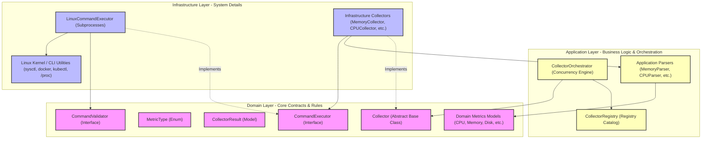

# Phase 1: Linux Collector Agent Walkthrough & Architecture

The **Linux Collector Agent** is a production-grade, highly secure, non-blocking telemetry collection subsystem. It operates as the foundation of the SRE Platform, capturing host, container, and cluster metrics, normalizing them into structured domain models, and presenting them safely for upstream event parsing, incident grouping, and automated healing analysis.

---

## 1. System Architecture

The system is designed strictly around **Clean Architecture** boundaries. Dependencies only point inwards:

---

## 2. File-by-File Responsibility Directory

### A. The Domain Layer (`src/domain/`)
The Domain layer defines the core contracts, security policies, and schema structures. It is independent of any third-party framework or operating system utility.

| File Path | Responsibility |
| :--- | :--- |
| [collector.py](file:///e:/AI_SRE/src/domain/collectors/collector.py) | Declares the `Collector` abstract class. Forces all concrete collectors to expose a `name`, a `metric_type`, and an async `collect()` routine. |
| [collector_result.py](file:///e:/AI_SRE/src/domain/collectors/collector_result.py) | Holds `CollectorResult` Pydantic schema mapping structured payloads, host metadata, execution lifecycle latency, and parsing errors. |
| [collector_status.py](file:///e:/AI_SRE/src/domain/collectors/collector_status.py) | Declares the collection outcome Enum (`SUCCESS` or `FAILED`). |
| [metric_type.py](file:///e:/AI_SRE/src/domain/collectors/metric_type.py) | Declares type-safe string constants for all collected metrics (`CPU`, `MEMORY`, `DISK`, `NETWORK`, `SERVICE`, `SYSTEM`, `LOG`, `DOCKER`, `KUBERNETES`). |
| [command_executor.py](file:///e:/AI_SRE/src/domain/executor/command_executor.py) | Declares the abstract `CommandExecutor` interface defining asynchronous shell pipelines. |
| [command_result.py](file:///e:/AI_SRE/src/domain/executor/command_result.py) | Wraps stdout, stderr, process exit codes, timeouts, and execution durations. |
| [command_validator.py](file:///e:/AI_SRE/src/domain/executor/command_validator.py) | Enforces the security boundary by validating arguments and verifying that all run commands match an explicit whitelist (e.g., `cat`, `df`, `lsblk`, `systemctl`, `docker`, `kubectl`). |
| [cpu_metrics.py](file:///e:/AI_SRE/src/domain/metrics/cpu_metrics.py) | Normalizes CPU time counters (user, system, idle, iowait). |
| [memory_metrics.py](file:///e:/AI_SRE/src/domain/metrics/memory_metrics.py) | Normalizes total, active, free, cached, and swap usage. |
| [disk_metrics.py](file:///e:/AI_SRE/src/domain/metrics/disk_metrics.py) | Normalizes mount usages, device I/O counters, and remaining space ratios. |
| [network_metrics.py](file:///e:/AI_SRE/src/domain/metrics/network_metrics.py) | Normalizes device RX/TX bytes and error flags. |
| [service_metrics.py](file:///e:/AI_SRE/src/domain/metrics/service_metrics.py) | Normalizes service load configurations and running states. |
| [system_metrics.py](file:///e:/AI_SRE/src/domain/metrics/system_metrics.py) | Normalizes hostname, OS, kernel versions, and shell details. |
| [log_metrics.py](file:///e:/AI_SRE/src/domain/metrics/log_metrics.py) | Normalizes syslog/journalctl events (timestamps, severities, emitting process metadata). |
| [docker_metrics.py](file:///e:/AI_SRE/src/domain/metrics/docker_metrics.py) | Normalizes container definitions, resource consumption states, network models, and volume details. |
| [kubernetes_metrics.py](file:///e:/AI_SRE/src/domain/metrics/kubernetes_metrics.py) | Normalizes cluster version details, namespaces, nodes, pods, deployments, services, and event streams. |

---

### B. The Application Layer (`src/application/`)
This layer handles the orchestration workflow, parallel collector scheduling, and parsing logic. It knows how to translate raw output strings into structured domain models, but it does *not* know how commands are run.

| File Path | Responsibility |
| :--- | :--- |
| [collector_registry.py](file:///e:/AI_SRE/src/application/orchestrator/collector_registry.py) | Manages registration and lifecycle mapping for all active collector classes. |
| [collector_orchestrator.py](file:///e:/AI_SRE/src/application/orchestrator/collector_orchestrator.py) | Schedules and executes registered collectors concurrently using an async tasks pool, logging metrics and managing collector lifecycle. |
| [cpu_parser.py](file:///e:/AI_SRE/src/application/parsers/cpu_parser.py) | Parses `/proc/stat` columns to calculate instantaneous times. |
| [memory_parser.py](file:///e:/AI_SRE/src/application/parsers/memory_parser.py) | Parses `/proc/meminfo` key-value pairs into standard integers. |
| [disk_parser.py](file:///e:/AI_SRE/src/application/parsers/disk_parser.py) | Combines `df` and `lsblk` outputs. |
| [network_parser.py](file:///e:/AI_SRE/src/application/parsers/network_parser.py) | Parses `/proc/net/dev` interface names and bytes count. |
| [service_parser.py](file:///e:/AI_SRE/src/application/parsers/service_parser.py) | Parses `systemctl list-units` rows. |
| [system_parser.py](file:///e:/AI_SRE/src/application/parsers/system_parser.py) | Parses `uname`, `hostname`, and file system releases. |
| [log_parser.py](file:///e:/AI_SRE/src/application/parsers/log_parser.py) | Extracts severity levels and log message structures defensively. |
| [docker_parser.py](file:///e:/AI_SRE/src/application/parsers/docker_parser.py) | Converts memory suffix formats (e.g. `MiB`/`GiB`) to raw bytes and parses inspect JSON models. |
| [kubernetes_parser.py](file:///e:/AI_SRE/src/application/parsers/kubernetes_parser.py) | Parses `kubectl` JSON arrays to extract namespaces, nodes, pods, and deployments. |

---

### C. The Infrastructure Layer (`src/infrastructure/`)
This layer handles concrete system details, subprocess executions, file reads, and OS interactions.

| File Path | Responsibility |
| :--- | :--- |
| [linux_command_executor.py](file:///e:/AI_SRE/src/infrastructure/executor/linux_command_executor.py) | Leverages Python's `asyncio.create_subprocess_exec` to run commands safely. It routes all inputs through the validator to prevent injection attacks and handles execution timeouts. |
| [cpu_collector.py](file:///e:/AI_SRE/src/infrastructure/collectors/cpu_collector.py) | Reads `/proc/stat` via `cat` and invokes the `CPUParser`. |
| [memory_collector.py](file:///e:/AI_SRE/src/infrastructure/collectors/memory_collector.py) | Reads `/proc/meminfo` via `cat` and invokes the `MemoryParser`. |
| [disk_collector.py](file:///e:/AI_SRE/src/infrastructure/collectors/disk_collector.py) | Runs `df` and `lsblk` commands, invoking `DiskParser`. |
| [network_collector.py](file:///e:/AI_SRE/src/infrastructure/collectors/network_collector.py) | Reads `/proc/net/dev` and invokes `NetworkParser`. |
| [service_collector.py](file:///e:/AI_SRE/src/infrastructure/collectors/service_collector.py) | Runs `systemctl` commands and invokes `ServiceParser`. |
| [system_collector.py](file:///e:/AI_SRE/src/infrastructure/collectors/system_collector.py) | Runs `uname`, `hostname` checks and invokes `SystemParser`. |
| [log_collector.py](file:///e:/AI_SRE/src/infrastructure/collectors/log_collector.py) | Fallback reads logs from `journalctl`, `/var/log/syslog`, or `/var/log/messages`, invoking `LogParser`. |
| [docker_collector.py](file:///e:/AI_SRE/src/infrastructure/collectors/docker_collector.py) | Runs `docker ps`, `inspect`, and `stats`, invoking `DockerParser`. |
| [kubernetes_collector.py](file:///e:/AI_SRE/src/infrastructure/collectors/kubernetes_collector.py) | Runs `kubectl get` commands to fetch cluster resources, invoking `KubernetesParser`. |

---

## 3. Key Design Patterns Implemented

1.  **Dependency Injection (DI)**: Collectors do not instantiate their own executors; they accept a `CommandExecutor` interface at runtime. This allows us to mock the entire OS layer during testing without executing real subprocesses.
2.  **Defensive Parsing**: Parsers wrap execution blocks in try-except statements, handling missing metrics, partial output strings, and different CLI version outputs gracefully.
3.  **Strict Security Whitelist**: The validation layer prevents arbitrary shell injections by strictly validating arguments and blocking characters like `&`, `;`, `\|`, `$`, and command substitutions.
